# Install-Ubuntu

## Step 1: ดาวน์โหลดไฟล์ iso เพื่อใช้ในการติดตั้ง
 <p align="center">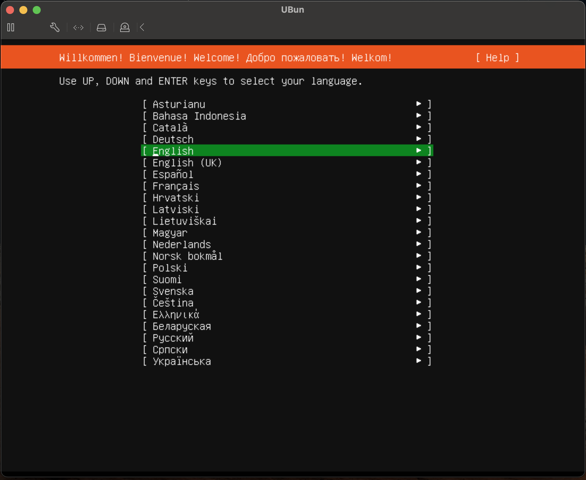</p>
 
## Step 2: ใส่แผ่น DVD หรือ USB และรีบูทเครื่องเพื่อเริ่มการติดตั้ง
 <p align="center"></p>

## Step 3: เลือกภาษาของคีย์บอร์ดที่ต้องการติดตั้ง
เลือกภาษาของคีย์บอร์ด ในระบบ Ubuntu ที่ต้องการใช้งาน หรือถ้าไม่แน่ใจให้เลือก Identify Keyboard เพื่อจะช่วย detect ให้อัตโนมัติ หลังจากเลือกภาษาแล้วให้กดลูกศรลงไปที่ Done
 <p align="center">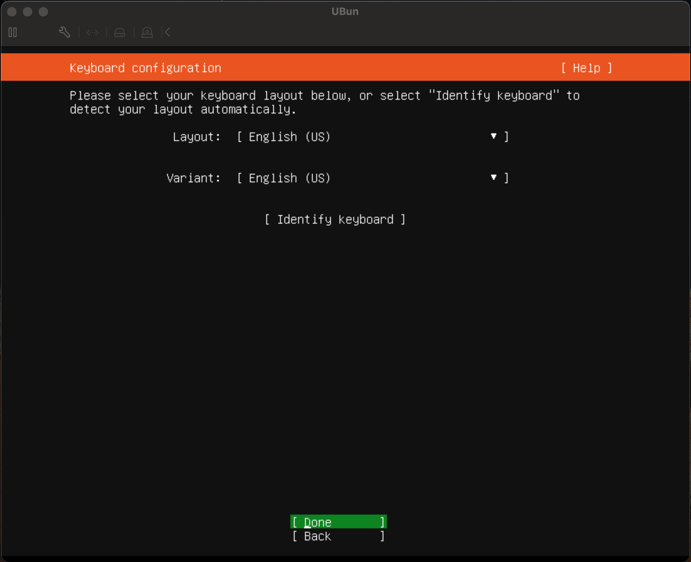</p>

## Step 4: ตั้งค่าระบบเครือข่าย
หน้าจอการตั้งค่าระบบเครือข่ายจะเเสดงการด์แลนที่มีอยู่ทั้งหมดของเครื่อง สามารถกำหนดค่าคอนฟิก IP Address ได้ทั้ง Manual หรือจะใช้งานแบบ DHCP ก็ได้ และสามารถเปลี่ยนแปลงได้ในภายหลัง หลังจากคอนฟิกเสร็จให้เลือก Done
 <p align="center">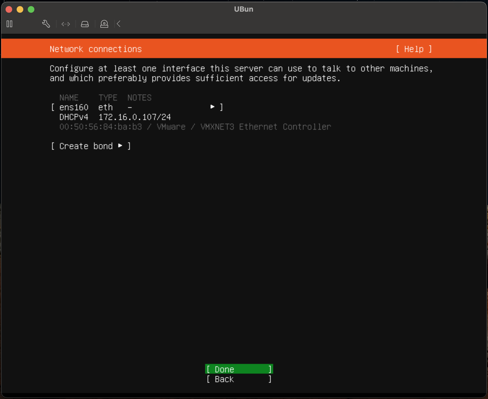</p>
 
## Step 5: ตั้งค่าพร็อกซี่
ถ้าต้องการใช้งาน Proxy เพื่อเชื่อมต่ออินเตอร์ สามารถกรอกได้ที่ Proxy address แล้วเลือก Done
 <p align="center">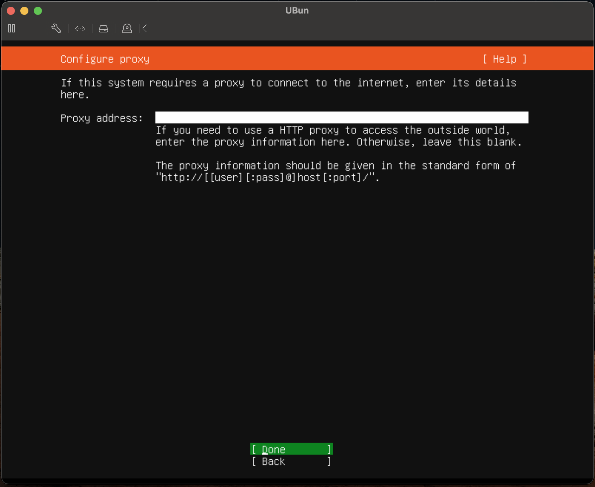</p>
 
## Step 6: ตั้งค่า Mirror Server (แหล่งอัพเดทซอฟต์แวร์)
ถ้าต้องการใช้งาน mirror address ก็สามารถแก้ไขได้ที่หน้าจอนี้ แล้วเลือก Done
 <p align="center">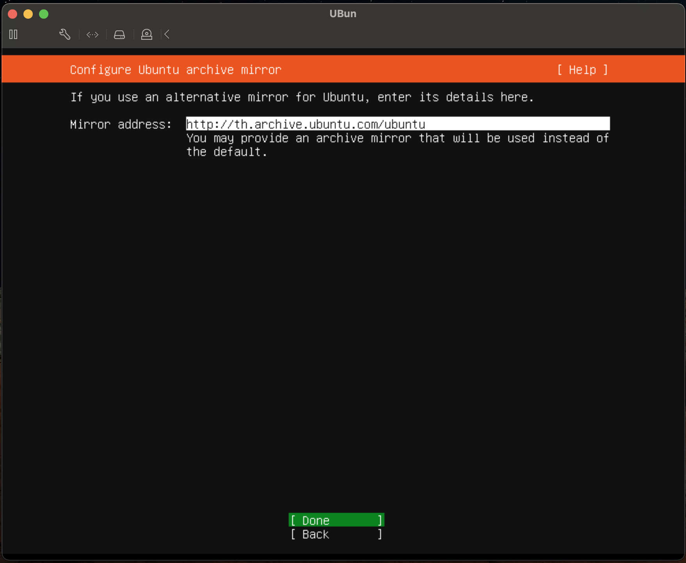</p>
 
## Step 7: เลือก Hard disk ที่ต้องการติดตั้ง
- Use an entire disk ใช้ Disk ทั้งหมด และสามารถเลือก Set up this disk as an LVM group ใช้ LVM (Logical Volume Manager) เพื่อแบ่งพาร์ติชันดิสก์
- Custom storage layout สามารถแบ่ง พาร์ติชันดิสก์ ได้เองตามต้องการคลิก Space bar เพื่อเลือกโหมดที่ต้องการ หลังจากนั้นเลือกไปที่ Done
 <p align="center">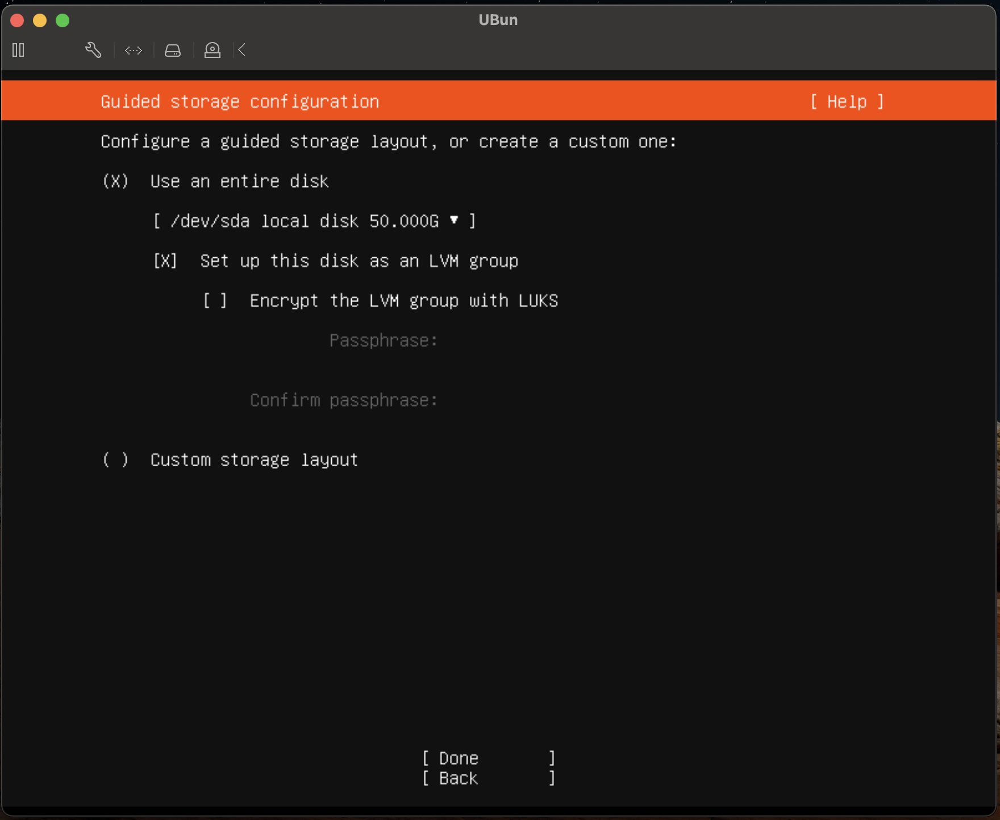</p>
 
- หน้านี้จะแสดงพาร์ติชันดิสก์ ที่จะทำเราได้ทำการเลือก เช็คข้อมูลเรียบร้อยให้คลิก Done
 <p align="center">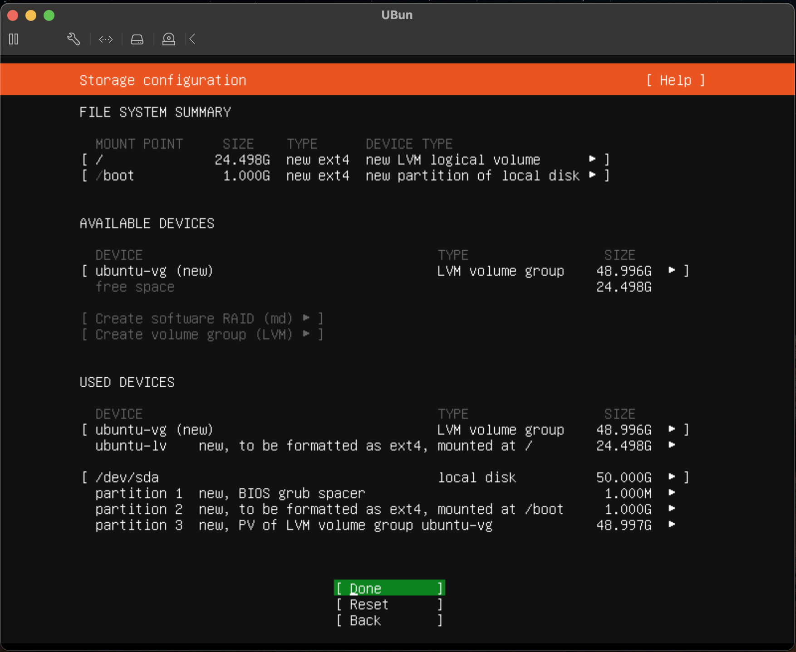</p>
 
 <p align="center"></p>
 
 ## Step 8: ตั้งค่าผู้ใช้งาน
ใส่ชื่อผู้ใช้และชื่อ Server ของระบบพร้อมกับรหัสผ่านของผู้ใช้
- Your name: ชื่อผู้ใช้แสดงในระบบ
- Your Server’s name: ชื่อของ Server
- Pick a username: username ที่ใช้ login เข้าระบบ
- Choose a password: password ที่ใช้ login เข้าระบบ
- Confirm your password: ใส่ password อีกครั้งเพื่อ confirm หลังจากนั้นเลือก Done

 <p align="center">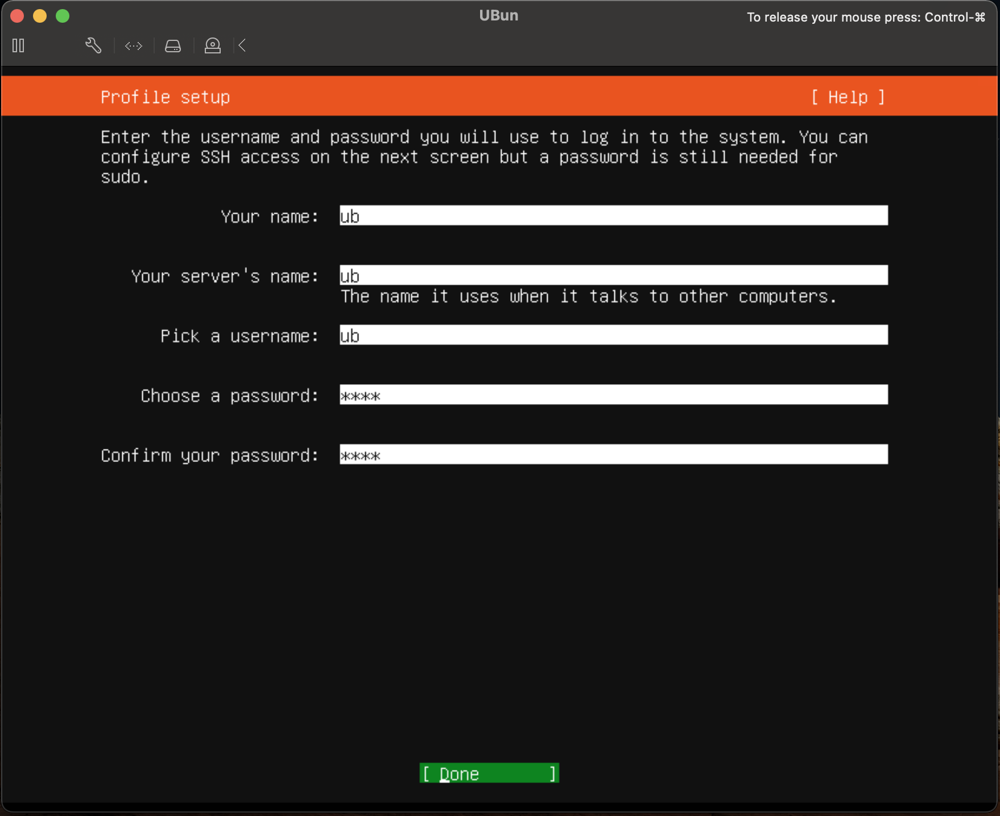</p>
 
 ## Step 9: ตัวเลือกการติดตั้ง Open SSH Server
 สามารถเลือกติดตั้ง SSH ได้หรือจะติดตั้งที่หลังก็ได้ Open ssh server เป็นเซอร์วิสที่ทำให้เราสามารถรีโมทเข้ามาจัดการกับ Ubuntu Server ของเราได้ผ่านทางโปรโตคอล secure shell
 <p align="center">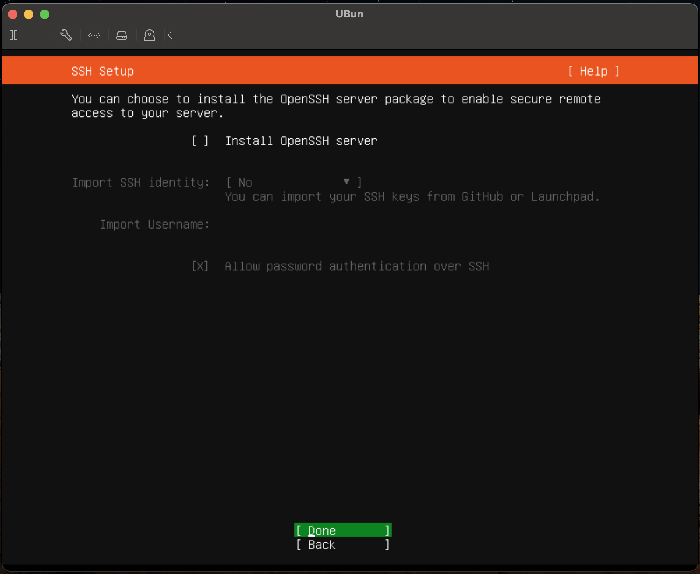</p>
 
## Step 10: ตัวเลือกติดตั้ง Featured Server Snaps ของ Ubuntu
สามารถเลือกแพ็คเกจที่เราต้องการติดตั้งได้จากหน้านี้าเลยหรือจะทำการติดตั้งในภายหลังก็ได้
 <p align="center">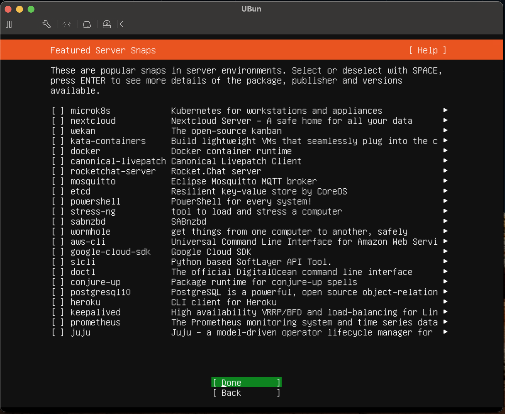</p>
 
รอติดตั้งจนเสร็จแล้วทำการ Reboot เป็นอันเสร็จเรียบร้อย
<p align="center">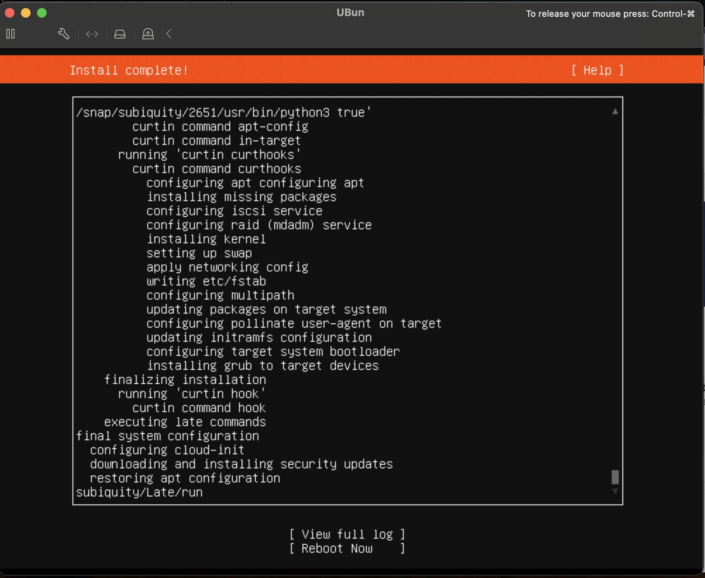</p>

```sh
sudo apt update

```
```sh
sudo apt install git
```
```sh
sudo apt install nodejs

```
<p align="center">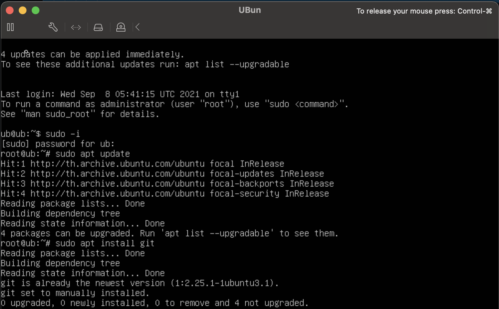</p>
<p align="center"></p>

